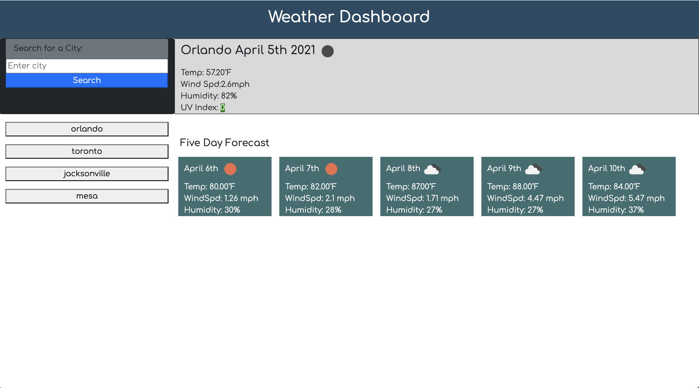

# Challenge 6 UCF BootCamp Weather Dashboard
This is an application to view the weather of different cities with the open weather map api.

github repo: https://github.com/cpagan415/weather-dashboard

github live page: https://cpagan415.github.io/weather-dashboard/

There are a few issues I still need to revisit:
1.User validation when entering term in form
2.CSS for mobile devices 
